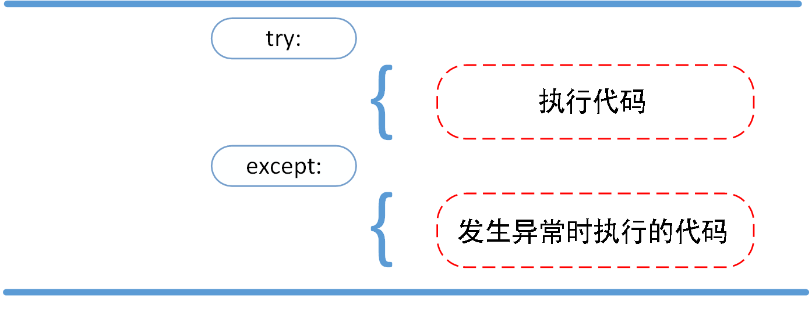

# Python3 错误和异常

作为 Python 初学者，在刚学习 Python 编程时，经常会看到一些报错信息，在前面我们没有提及，这章节我们会专门介绍。

Python 有两种错误很容易辨认：语法错误和异常。

Python `assert`（断言）用于判断一个表达式，在表达式条件为 false 的时候触发异常。

## 语法错误

Python 的语法错误或者称之为解析错，是初学者经常碰到的。

```Python
while True print('Hello world') 
```

这个例子中，函数` print() `被检查到有错误，是它前面缺少了一个冒号`:` 。

语法分析器指出了出错的一行，并且在最先找到的错误的位置标记了一个小小的箭头。

## 异常

即便 Python 程序的语法是正确的，在运行它的时候，也有可能发生错误。运行期检测到的错误被称为异常。

大多数的异常都不会被程序处理，都以错误信息的形式展现在这里:

#### 练习：不同类型的异常

```Python
#ZeroDivisionError: division by zero
10 * (1/0)             # 0 不能作为除数，触发异常
```
```Python
#NameError: name 'spam' is not defined
4 + spam*3             # spam 未定义，触发异常
```
```Python
#TypeError: Can't convert 'int' object to str implicitly
'2' + 2               # int 不能与 str 相加，触发异常
```

异常以不同的类型出现，这些类型都作为信息的一部分打印出来: 例子中的类型有`ZeroDivisionError`，`NameError`和`TypeError`。

错误信息的前面部分显示了异常发生的上下文，并以调用栈的形式显示具体信息。

## 异常处理

### try/except

异常捕捉可以使用`try/except`语句。



以下例子中，让用户输入一个合法的整数，但是允许用户中断这个程序（使用 Control-C 或者操作系统提供的方法）。用户中断的信息会引发一个 `KeyboardInterrupt`异常。

#### 练习：Python异常处理try/except

```Python
while True:
    try:
        x = int(input("请输入一个数字: "))
        break
    except ValueError:
        print("您输入的不是数字，请再次尝试输入！")
```

try 语句按照如下方式工作；
- 首先，执行` try` 子句（在关键字 `try` 和关键字 `except` 之间的语句）。
- 如果没有异常发生，忽略` except `子句，`try` 子句执行后结束。
- 如果在执行 `try` 子句的过程中发生了异常，那么 try 子句余下的部分将被忽略。如果异常的类型和 except 之后的名称相符，那么对应的` except `子句将被执行。
- 如果一个异常没有与任何的` except` 匹配，那么这个异常将会传递给上层的 `try `中。

一个 `try` 语句可能包含多个`except`子句，分别来处理不同的特定的异常。最多只有一个分支会被执行。

处理程序将只针对对应的 try 子句中的异常进行处理，而不是其他的`try`的处理程序中的异常。

一个`except`子句可以同时处理多个异常，这些异常将被放在一个括号里成为一个元组，例如:
```
except (RuntimeError, TypeError, NameError):
    pass
```
最后一个`except`子句可以忽略异常的名称，它将被当作通配符使用。你可以使用这种方法打印一个错误信息，然后再次把异常抛出。

```Python
import sys
 
try:
    f = open('myfile.txt')
    s = f.readline()
    i = int(s.strip())
except OSError as err:
    print("OS error: {0}".format(err))
except ValueError:
    print("Could not convert data to an integer.")
except:
    print("Unexpected error:", sys.exc_info()[0])
    raise
```

### try/except...else

`try/except` 语句还有一个可选的`else`子句，如果使用这个子句，那么必须放在所有的 `except`子句之后。

`else`子句将在`try`子句没有发生任何异常的时候执行。


以下实例在 try 语句中判断文件是否可以打开，如果打开文件时正常的没有发生异常则执行 else 部分的语句，读取文件内容：

#### 练习：Python异常处理try/except...else

```Python
for arg in sys.argv[1:]:
    try:
        f = open(arg, 'r')
    except IOError:
        print('cannot open', arg)
    else:
        print(arg, 'has', len(f.readlines()), 'lines')
        f.close()
```

使用 else 子句比把所有的语句都放在`try`子句里面要好，这样可以避免一些意想不到，而`except`又无法捕获的异常。

异常处理并不仅仅处理那些直接发生在`try`子句中的异常，而且还能处理子句中调用的函数（甚至间接调用的函数）里抛出的异常。例如:

```Python
def this_fails():
    x = 1/0
   
try:
    his_fails()
```

### try-finally 语句

`try-finally`语句无论是否发生异常都将执行最后的代码。


以下实例中`finally`语句无论异常是否发生都会执行：

#### 练习：Python异常处理try-finally

```Python
try:
    test()
except AssertionError as error:
    print(error)
else:
    try:
        with open('file.log') as file:
            read_data = file.read()
    except FileNotFoundError as fnf_error:
        print(fnf_error)
finally:
    print('这句话，无论异常是否发生都会执行。')
```


## 抛出异常

Python 使用`raise`语句抛出一个指定的异常。

raise语法格式如下：

`raise [Exception [, args [, traceback]]]`


#### 练习：Python异常处理抛出异常`raise`

`raise `唯一的一个参数指定了要被抛出的异常。它必须是一个异常的实例或者是异常的类（也就是 Exception 的子类）。

```Python
#如果`x`的值大于 5 就触发异常:
x = 10
if x > 5:
    raise Exception('x 不能大于 5。x 的值为: {}'.format(x))
```

如果你只想知道这是否抛出了一个异常，并不想去处理它，那么一个简单的 raise 语句就可以再次把它抛出。

```Python
try:
    raise NameError('HiThere')
except NameError:
    print('An exception flew by!')
    raise
```

## 用户自定义异常

你可以通过创建一个新的异常类来拥有自己的异常。异常类继承自 Exception 类，可以直接继承，或者间接继承

#### 练习：用户自定义异常

```Python
class MyError(Exception):
    def __init__(self, value):
        self.value = value
    def __str__(self):
        return repr(self.value)
   
try:
    raise MyError(2*2)
except MyError as e:
   
#My exception occurred, value: 4
raise MyError('oops!')
```

在这个例子中，类`Exception`默认的 __init__() 被覆盖。

当创建一个模块有可能抛出多种不同的异常时，一种通常的做法是为这个包建立一个基础异常类，然后基于这个基础类为不同的错误情况创建不同的子类:

```Python
class Error(Exception):
    """Base class for exceptions in this module."""
    pass
 
class InputError(Error):
    """Exception raised for errors in the input.
 
    Attributes:
        expression -- input expression in which the error occurred
        message -- explanation of the error
    """
 
    def __init__(self, expression, message):
        self.expression = expression
        self.message = message
 
class TransitionError(Error):
    """Raised when an operation attempts a state transition that's not
    allowed.
 
    Attributes:
        previous -- state at beginning of transition
        next -- attempted new state
        message -- explanation of why the specific transition is not allowed
    """
 
    def __init__(self, previous, next, message):
        self.previous = previous
        self.next = next
        self.message = message
```

大多数的异常的名字都以`Error`结尾，就跟标准的异常命名一样。

## 定义清理行为

try 语句还有另外一个可选的子句，它定义了无论在任何情况下都会执行的清理行为。 

#### 练习：Python异常定义清理行为

```Python
try:
    raise KeyboardInterrupt
finally:
    print('Goodbye, world!')
```

以上例子不管`try`子句里面有没有发生异常，`finally` 子句都会执行。

如果一个异常在 `try` 子句里（或者在 `except` 和 `else` 子句里）被抛出，而又没有任何的 `except` 把它截住，那么这个异常会在 `finally` 子句执行后被抛出。

下面是一个更加复杂的例子（在同一个 try 语句里包含 except 和 finally 子句）:

```Python
def divide(x, y):
    try:
        result = x / y
    except ZeroDivisionError:
        print("division by zero!")
    else:
        print("result is", result)
    finally:
        print("executing finally clause")

divide(2, 1)
divide(2, 0)
divide("2", "1")
```

## 预定义的清理行为

一些对象定义了标准的清理行为，无论系统是否成功的使用了它，一旦不需要它了，那么这个标准的清理行为就会执行。

这面这个例子展示了尝试打开一个文件，然后把内容打印到屏幕上:

```Python
for line in open("myfile.txt"):
    print(line, end="")
```

以上这段代码的问题是，当执行完毕后，文件会保持打开状态，并没有被关闭。

关键词 with 语句就可以保证诸如文件之类的对象在使用完之后一定会正确的执行他的清理方法:

```Python
with open("myfile.txt") as f:
    for line in f:
        print(line, end="")
```

以上这段代码执行完毕后，就算在处理过程中出问题了，文件 f 总是会关闭。
<code class=backend-type backend-type=free></code>
<code class=gatsby-kernelname data-language=python></code>
<script type="text/javascript" src="https://cdn.freeaihub.com/asset/js/cell.js"></script>
